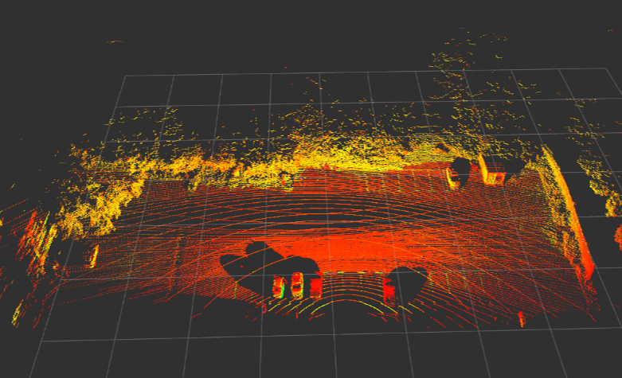
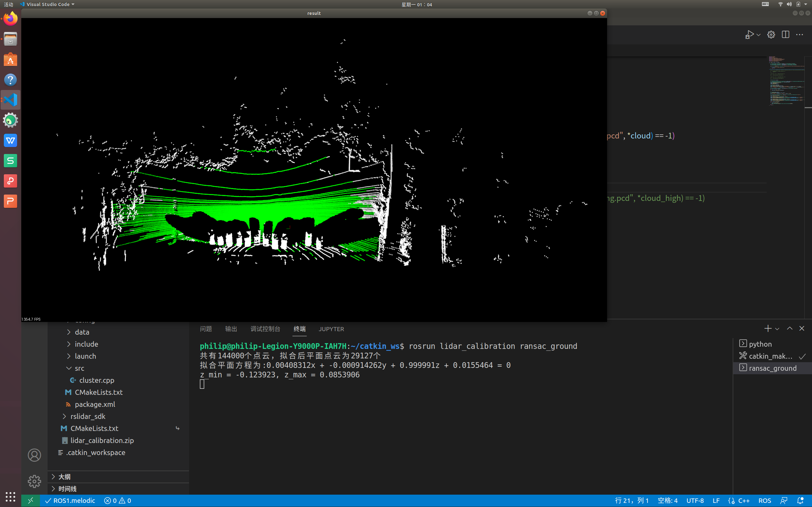
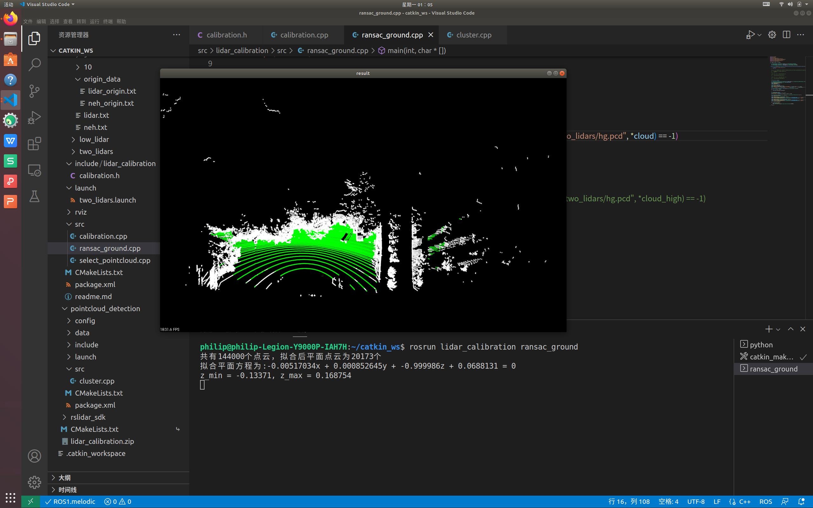
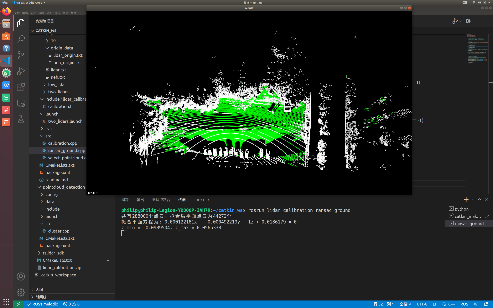

# lidar_calibration

## 项目简介
本项目实现了激光雷达标定外参矩阵的数据处理，获取从激光雷达坐标系到东北天坐标系的齐次变换矩阵

## 环境配置
* OpenCV
* PCL
* ROS

## 使用方法
1. 订阅rosbag中对应雷达话题并转换为pcd文件（如果有pcd文件可跳过此步骤）;<br>
* 以速腾的激光雷达为例: 订阅/rslidar_points话题中的点云数据并保存

``` bash
$ rosrun pcl_ros pointcloud_to_pcd /input:=/rslidar_points ./
```
参数./改为你要保存.pcd点云的目录./代表当前终端所在目录，点云最后的保存形式为 '时间戳.pcd'，如'1630559271.pcd',此处改为[board.pcd](data/board.pcd)<br>

2. 使用[select_pointcloud.cpp](src/select_pointcloud.cpp)的函数plot_and_choose()读取步骤1中截取的pcd文件，然后手动选择（shift+鼠标左键）标定板两个底部角点在激光雷达坐标系下的坐标，并将坐标存到[lidar.txt](data/lidar.txt)中;<br>
[lidar.txt](data/lidar.txt)文件中的数据格式为点云的三维坐标：x,y,z<br>

3. 将从手持RTK中得到的标定板两个底部角点在东北天（全局）坐标系下的坐标存到[neh.txt](data/neh.txt)中;
* 注：lidar.txt与neh.txt中的点必须对应起来，即是同一个角点分别在激光雷达坐标系下和东北天（全局）坐标系下的坐标。

4. 用[calibration.cpp](src/calibration.cpp)的函数read_lidar_txt()读取激光雷达坐标系下的角点坐标并存到lidar_points中，用read_neh_txt()读取东北天坐标系下的角点坐标并存到global_points;

5. 用[calibratio.cpp](src/calibration.cpp)函数pose_estimation_3d3d(),即Kabsch算法，去计算从激光雷达坐标系到东北天坐标系的齐次变换矩阵transformation_matrix_low_to_global;

6. 用[calibratio.cpp ](src/calibration.cpp)函数RotationMatrix2RPY()计算步骤5中得到的齐次变换矩阵左上角3x3的旋转矩阵对应的欧拉角，用于后续速腾雷达参数设置中的roll, pitch, yaw;

7. (可选) 用[calibratio.cpp ](src/calibration.cpp)在ROS订阅原始雷达信息，转换成PCL点云格式后利用齐次变换矩阵将点云变换到全局坐标系下，然后发布出去，该操作主要通过回调函数low_callback()完成。

## 标定结果
1. 两个激光雷达拼接效果

2. 激光雷达地面拟合结果
* 低处激光雷达

* 高处激光雷达

* 两个激光雷达拼接
